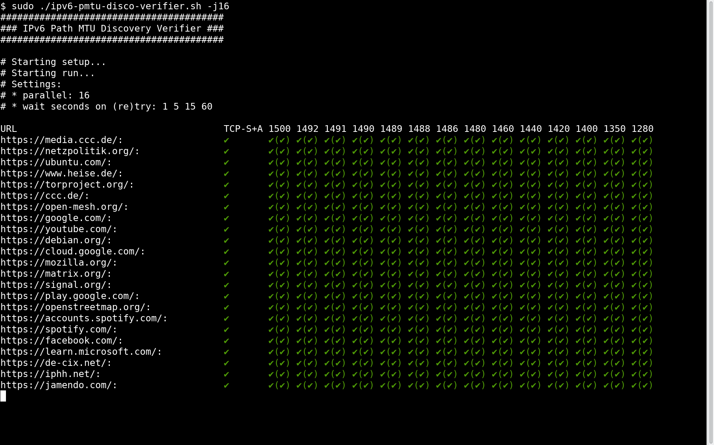
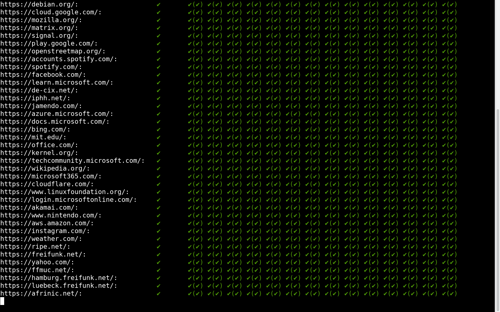
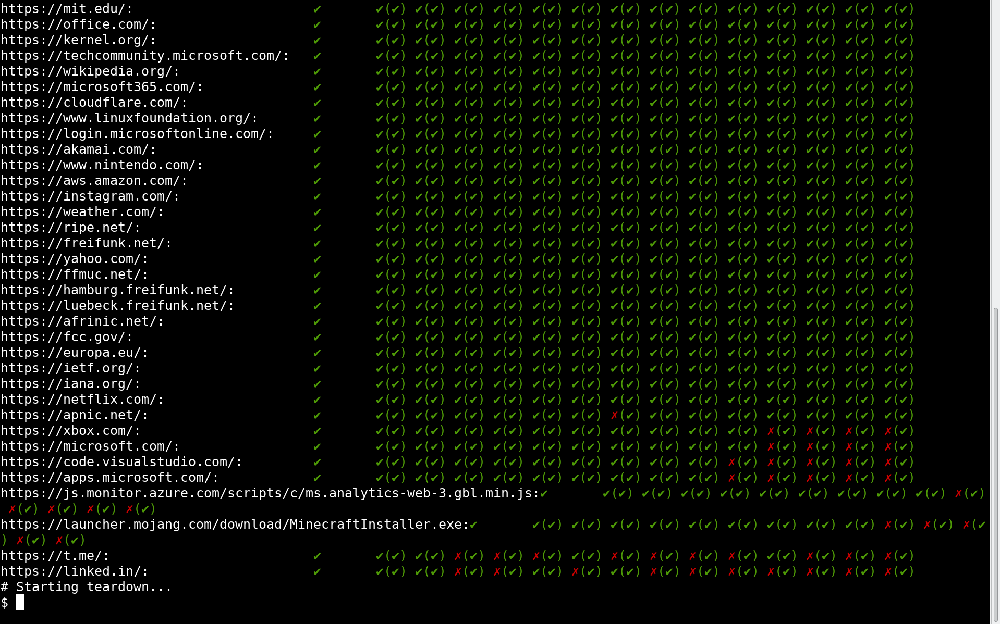

# IPv6 Path MTU Discovery Verifier

IPv6 Path MTU Discovery Verifier - Check if IPv6 websites correctly honour ICMPv6 Packet Too Big packets

## Usage

Help page:

```
$ ./ipv6-pmtu-disco-verifier.sh -h
########################################
### IPv6 Path MTU Discovery Verifier ###
########################################

# Check if IPv6 websites/hosts correctly honour ICMPv6 Packet Too Big packets
# and if these hosts reduce their packet size accordingly.
#
# To test this this simulates a) asymmetric routes where b) only one
# direction has a lower MTU (like a VPN tunnel would have).
# It creates the following, virtual test topology via network namespaces
# for each configured test MTU:
#
#   ~~~~~~~     /----------------------------------------------------------\
# ~ Internet ~  |This    ```````````````````````    `````````````````````` |
#    ~~~~       |host    `ns:vrtr   <veth-tx>-------->><veth-rx>  ns:vcli` |
#     ||        |        `         ^           `    `           v        ` |
# { Local  }=======[br0]==<veth-wan>           `    `           <lo>     ` |
#   Router      |        `         ^           `    `           v        ` |
#               |        `          <veth-rx><<========<veth-tx>         ` |
#               |        ```````````````````````    `````````````````````` |
#               \----------------------------------------------------------/
#
# 1) Packets from the virtual client to the internet host
#    (vcli: [lo => veth-tx] =>
#     vrtr: [veth-rx => veth-wan] => br0 =>
#     Local Router => Internet => Website)
#    will do normal, full MTU roaming.
# 2) But: Packets from the internet host to the virtual client
#    (Website => Internet => Local Router =>
#     vrtr: [ veth-wan => veth-tx ] ->
#     vcli: [ veth-rx => lo ])
#   will have a **reduced MTU** (note: ->/- vs. =>/=) to e.g. simulate
#   a tunnel, like a VPN or PPPoE.

# Test output:
# * TCP-S+A column: basic check via nmap, does a TCP-SYN packet get a TCP-SYN-ACK reply?
# * 1280-1500 columns: HTTP GET via wget from vcli, with reduced MTU in RX direction
#   * (✔/✗): same, but with the TCP-MSS mangled to the low MTU via ip6tables on vcli:veth-tx
#     => NOTE: When this check works, but without the TCP-MSS mangling it doesn't then this
#              is a very strong indicator that the ICMPv6 Packet Too Big packets did not
#              make it to the target website!

Usage: ./ipv6-pmtu-disco-verifier.sh
        [-b <br-iface>]            bridge interface with uplink+radvd (def.: br0)
        [-u <URLS-FILE|->]         file with URLs to check (def.: misc. ~60 URLs)
        [-m "<MTU> <MTU> ..."]     MTUs to test, between 1280 and 1500 (def.: misc. 14)
        [-j <num-parallel>]        number of parallel jobs (def.: 8)
        [-w "<sec> <sec> ..."]     wait seconds before retry (def.: "1 5 15 60")
        [-r <RESOLV-CONF-FILE>]    resolv.conf with IPv6 nameserver (def.: ffmuc.net nameserver)
        [-H <HOSTS-FILE>]          an "/etc/"hosts file (def.: from setup host)
        [-c setup|run|teardown]    (def.: setup+run+teardown)
        [-h]                       this help + usage page
```

## Requirements

* Linux
* A bridge interface (by default br0) with IPv6 connectivity via ICMPv6 Router Advertisements / Stateless address autoconfiguration (SLAAC), e.g. via:
```
$ ip link add dev br0 type bridge
$ ip link set up dev br0
$ ip link set dev <eth-uplink-interface> master br0
```
* Root permissions
* The following tools: `bash ip sed grep stdbuf wget ip6tables flock xargs nmap bwrap`

## Screenshots





## Internal Setup Schematics


